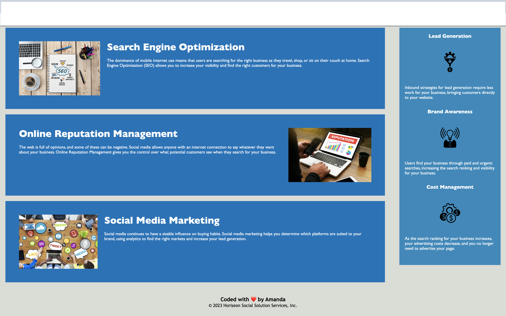

# suspicious-pancake

# Code Refactor Starter Code

## Description:

This project was centered around the optimization and accessibility of the
Horiseon website. Changes and insertions were made to make the site more
accessible onlihne, images are visible, and the code is following semantic HTML.
In doing so improves the search engine optimization rating.

GIVEN a webpage meets accessibility standards WHEN I view the source code

THEN I find semantic HTML elements

WHEN I view the structure of the HTML elements

THEN I find that the elements follow a logical structure independent of styling
and positioning

WHEN I view the image elements

THEN I find accessible alt attributes

WHEN I view the heading attributes THEN they fall in sequential order

WHEN I view the title element

THEN I find a concise descriptive title

Original code was forked from
https://github.com/coding-boot-camp/urban-octo-telegram. Create a unique name
for a respository and rename the cloned copy of the original template in GitHub.
Create a fork copy and open in VS Code. Update image tags with alt tags with
description of the images. Update the href links with URLs to wikipedia sites.
Update href to open in new tab instead of the same window. Update the headers to
be in correct order- h1, h2, h3, h4. Update HTML to include footer element
inside the class="footer" div at the bottom. Upate footer paragraph with
customed verbiage, ie "Coded with ❤️️ by Amanda." Publish commits to GitHub and
deploy site on Chrome to test and view code.

## Screenshots of completed website:

